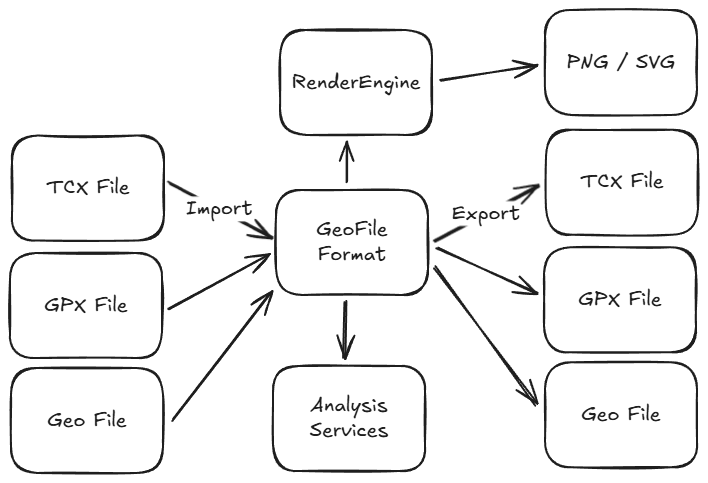

# Spatial Library
Spatial Analysis library to ingest track point files e.g. TCX or GPX, convert to common format and allow analysis to be performed and egressed to different formats.

## Project Structure
Breakdown of the project structure and the different components.

### Spatial.Core
Core services for route calculation and analysis.

The core service is designed to take in a list of track points in a veriety of formats (e.g. TCX, GPX) and convert them into a common format (GeoFile) to be analysed.

Types of analysis include comparing two routes to check for similarities, calculating the distances for a given set of points, finding fastest sections of a given distance etc.

### Spatial.RenderEngine
Generation of visualisations for routes.

### Spatial.UI
User interface for the library.
